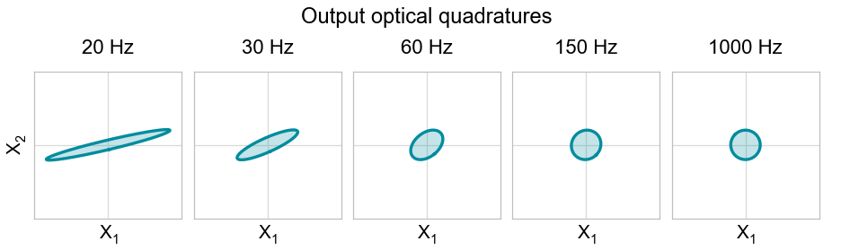
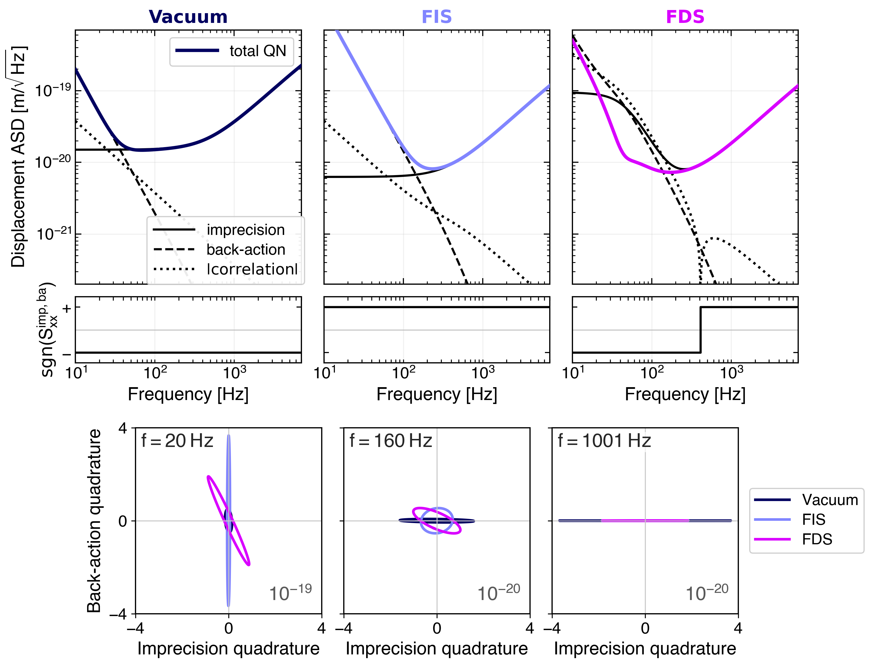
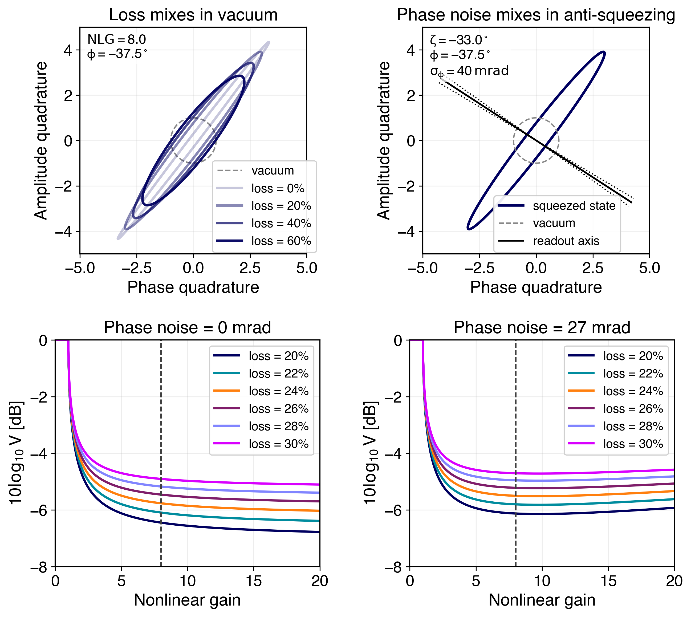

# LIGO Quantum Tools

A collection of interactive visualization and figure-building tools developed while preparing the review article **_Quantum Noise Engineering in Advanced LIGO_**, currently in preparation for *Contemporary Physics*.

Together, the tools follow squeezed-light quantum noise from state preparation, through interferometer propagation and quantum-noise decomposition, to practical implementation limits from optical loss and phase noise. Each tool lives in its own directory and has a dedicated README describing its equations, assumptions, controls, and dependencies.

## Tools

### `squeezing-ellipse-visualizer`

Interactive GUI for visualizing the **input squeezed quantum state** before interferometer propagation.

The tool compares vacuum, frequency-independent squeezing (FIS), and frequency-dependent squeezing (FDS) as quadrature covariance ellipses. It applies the selected squeezing level and angle, optional injection loss, and—in the FDS case—the frequency-dependent rotation produced by the filter-cavity model.

This tool is intended to isolate the physics of squeezed-state preparation before the detector response is introduced.

[](squeezing-ellipse-visualizer/README.md)

See [`squeezing-ellipse-visualizer/README.md`](squeezing-ellipse-visualizer/README.md) for the equations and assumptions used.

---

### `output-qstate-ellipse-visualizer`

Interactive GUI for visualizing optical quadrature covariance ellipses before and after propagation through a GWINC interferometer model.

The input state can be vacuum, frequency-independent squeezing (FIS), or frequency-dependent squeezing (FDS). The GUI uses the selected GWINC YAML model to construct the interferometer response and can include optomechanical coupling, SEC detuning, internal optical loss, and spatial mode mismatch.

When spatial mode mismatch is active, the calculation uses GWINC's higher-order-mode representation and projects the propagated covariance back onto the detected fundamental mode using GWINC's local-oscillator vectors.

[](output-qstate-ellipse-visualizer/README.md)

See [`output-qstate-ellipse-visualizer/README.md`](output-qstate-ellipse-visualizer/README.md) for the full model description.

---

### `quantum-noise-decomposer`

Interactive GUI for decomposing the modeled quantum-noise spectrum into **measurement imprecision, radiation-pressure back-action, and their correlation**, while also visualizing the corresponding covariance ellipses.

The decomposition uses the power dependence

```math
S_{\rm QN}(P)
=
\frac{A}{P}
+
BP
+
C,
```

with the three coefficients extracted from GWINC calculations at multiple arm powers. The tool compares Vacuum, FIS, and FDS configurations and shows both the magnitude and sign of the correlation contribution.

The decomposition implemented here was originally developed for:

**B. Kabagöz et al., _Observing and Evading Quantum Back-Action on a Kilogram-Scale Oscillator_**  
[arXiv:2609.19317](https://arxiv.org/abs/2609.19317)

[](quantum-noise-decomposer/README.md)

See [`quantum-noise-decomposer/README.md`](quantum-noise-decomposer/README.md) for the decomposition equations, covariance construction, assumptions, and GWINC dependence.

---

### `loss-phase-noise-visualizer`

Interactive GUI illustrating how optical loss and phase noise limit observed squeezing.

The upper panels provide schematic quadrature-space views of vacuum admixture and readout-axis jitter. The lower panels calculate observed variance as a function of nonlinear gain for selectable optical losses and phase-noise levels.

The model includes ideal OPO squeezing and anti-squeezing versus nonlinear gain, scalar optical loss modeled as vacuum admixture, Gaussian RMS phase noise, covariance-ellipse construction, independent layout and legend controls, and PDF/PNG/SVG export.

This tool is deliberately compact and does not include interferometer propagation or filter-cavity dynamics.

[](loss-phase-noise-visualizer/README.md)

See [`loss-phase-noise-visualizer/README.md`](loss-phase-noise-visualizer/README.md) for the equations and assumptions used.

## Manuscript context and disclaimer

These tools were developed while writing **_Quantum Noise Engineering in Advanced LIGO_**, prepared as a review article for *Contemporary Physics*.

They were created to support the figures, explanations, and physical intuition developed in that manuscript. The individual GUIs are intended primarily as research and visualization tools rather than as general-purpose or officially supported LIGO software.

The quantum-noise decomposition used by `quantum-noise-decomposer` predates the review and was originally developed for **_Observing and Evading Quantum Back-Action on a Kilogram-Scale Oscillator_** ([arXiv:2609.19317](https://arxiv.org/abs/2609.19317)). The interactive decomposition GUI was subsequently developed for the review manuscript.

The equations, assumptions, and approximations used by each tool are documented in its corresponding README. Where a tool interfaces with GWINC, its output also depends on the particular GWINC version and detector model used.

The repository may continue to evolve while the review manuscript is in preparation.

## Repository layout

```text
LIGO-quantum-tools/
├── README.md
├── squeezing-ellipse-visualizer.png
├── output-qstate-ellipse-visualizer.png
├── quantum-noise-decomposer.png
├── loss-phase-noise-visualizer.png
├── squeezing-ellipse-visualizer/
│   ├── README.md
│   ├── squeezing_ellipse_visualizer.py
│   └── ...
├── output-qstate-ellipse-visualizer/
│   ├── README.md
│   ├── ifo_optical_quadratures.py
│   ├── requirements.txt
│   └── ui.png
├── quantum-noise-decomposer/
│   ├── README.md
│   ├── qnoise_decomposer.py
│   ├── requirements.txt
│   └── ui.png
└── loss-phase-noise-visualizer/
    ├── README.md
    ├── loss_phase_noise_gui.py
    ├── requirements.txt
    └── ui.png
```

Detector-specific GWINC YAML files can be kept outside the repository and selected through the quadrature-propagation GUI.

## Requirements

Dependencies are listed separately for each tool.

The quadrature-propagation GUI requires a compatible GWINC installation because it uses internal functions from `gwinc.noise.quantum`. The quantum-noise decomposer also requires GWINC because its decomposition is built from repeated runs of the GWINC `Quantum` budget.

The remaining visualization tools use the standard Python packages listed in their own `requirements.txt` files.

## Related experimental work

**B. Kabagöz et al., _Observing and Evading Quantum Back-Action on a Kilogram-Scale Oscillator_**  
[arXiv:2609.19317](https://arxiv.org/abs/2609.19317)

The quantum-noise decomposition used in this repository was originally developed for this work.

## Use of language models

OpenAI language models were used as programming assistants during development of parts of this repository, including code organization, debugging, interface iteration, and documentation.

All scientific model choices, equations, parameter definitions, physical interpretation, and validation of the calculations were performed by the author(s). The language model was not used as an independent source of scientific validation.

## Status

These are research tools rather than a general-purpose software package. Interfaces and internal implementation may change as the associated review manuscript develops.
