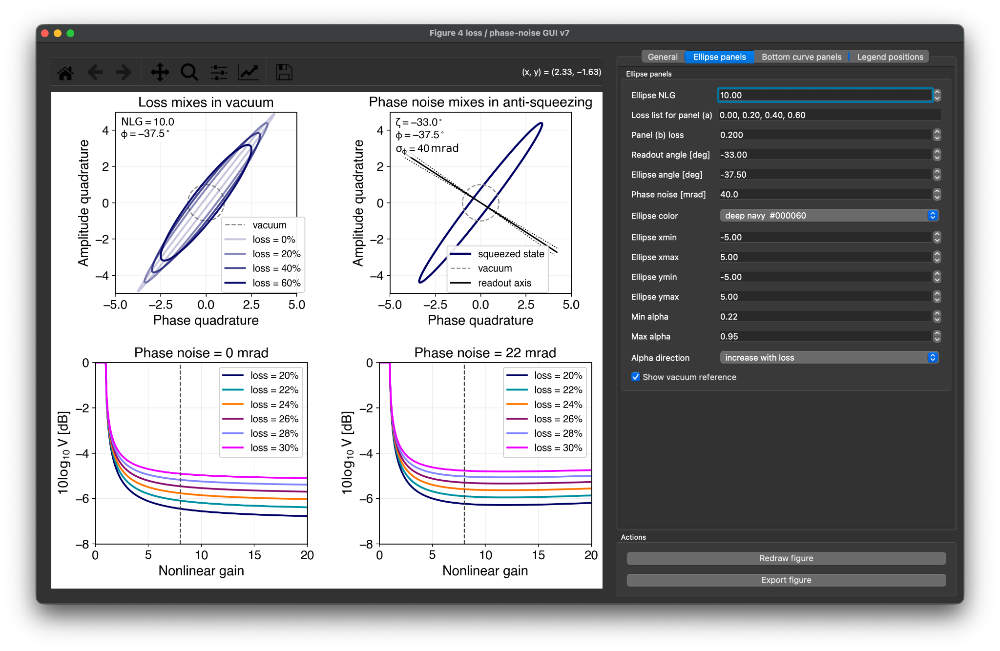

# Loss and phase-noise visualizer for squeezed states

Interactive PyQt/Matplotlib GUI for visualizing how optical loss and phase noise limit an ideal squeezed state.

The GUI combines two schematic quadrature-ellipse panels with two quantitative curves of observed variance versus nonlinear gain. The right-hand controls are organized into four layers: **General**, **Ellipse panels**, **Bottom curve panels**, and **Legend positions**. The **Redraw figure** and **Export figure** buttons remain visible below the control layers.

## Interface preview



## What the four panels show

- **Top left — loss mixes in vacuum.** An ideal squeezed state is generated at a selected nonlinear gain and then mixed with ordinary vacuum for several optical-loss values.
- **Top right — phase-noise schematic.** A squeezed ellipse is shown together with the nominal readout axis and dotted lines displaced by the selected RMS phase noise.
- **Bottom left — zero or low phase noise.** The measured variance is plotted versus nonlinear gain for a selected set of optical losses.
- **Bottom right — finite phase noise.** The same calculation is repeated with a second phase-noise value, showing the increasing penalty from anti-squeezing as nonlinear gain grows.

The ellipse panels are schematic quadrature-space illustrations. They are not frequency-dependent and do not include interferometer or filter-cavity propagation.

## Model and equations

### 1. Ideal OPO squeezing from nonlinear gain

The GUI parameterizes the ideal squeezed and anti-squeezed variances using the nonlinear gain \(G\). Vacuum noise is normalized to unity.

```math
V_{\rm sqz}(G)
=
\left(\sqrt{G}-\sqrt{G-1}\right)^2
```

```math
V_{\rm anti}(G)
=
\left(\sqrt{G}+\sqrt{G-1}\right)^2
```

For this ideal model,

```math
V_{\rm sqz}V_{\rm anti}=1.
```

The physical expression is used for \(G \ge 1\). The code clips numerical values below 1 to a value infinitesimally above 1, which allows the plotted nonlinear-gain axis to start at zero without evaluating the square root of a negative number.

### 2. Optical loss

A scalar optical-loss fraction \(L\) is modeled as mixing the state with ordinary vacuum. Defining the efficiency

```math
\eta = 1-L,
```

each quadrature variance transforms as

```math
V
\longrightarrow
\eta V + (1-\eta).
```

Because the injected loss field is assumed to be ordinary isotropic vacuum, loss drives both squeezed and anti-squeezed variances toward the vacuum value \(V=1\).

For the ellipse in the top-left panel, the code therefore uses

```math
V_{\rm sqz}^{(L)}
=
\eta V_{\rm sqz}+(1-\eta),
```

```math
V_{\rm anti}^{(L)}
=
\eta V_{\rm anti}+(1-\eta).
```

### 3. Gaussian phase noise

Phase noise is modeled as a zero-mean Gaussian fluctuation of the relative quadrature angle,

```math
\delta\theta \sim \mathcal{N}(0,\sigma_\phi^2),
```

where \(\sigma_\phi\) is entered in milliradians in the GUI and converted to radians internally.

For Gaussian angular jitter,

```math
\left\langle \cos^2\delta\theta \right\rangle
=
\frac12
\left(1+e^{-2\sigma_\phi^2}\right),
```

and

```math
\left\langle \sin^2\delta\theta \right\rangle
=
\frac12
\left(1-e^{-2\sigma_\phi^2}\right).
```

The phase-noise-averaged measured variance is therefore

```math
V_{\phi}
=
V_{\rm sqz}
\frac{1+e^{-2\sigma_\phi^2}}{2}
+
V_{\rm anti}
\frac{1-e^{-2\sigma_\phi^2}}{2}.
```

This expression explicitly shows how phase noise mixes anti-squeezing into the measured squeezed quadrature.

The bottom panels then apply optical loss to this phase-noise-averaged variance:

```math
V_{\rm obs}
=
\eta V_{\phi}+(1-\eta).
```

The plotted quantity is

```math
V_{\rm dB}
=
10\log_{10} V_{\rm obs}.
```

Vacuum therefore corresponds to \(0\) dB.

### 4. Covariance ellipse

For the schematic ellipse panels, the principal squeezed and anti-squeezed variances are assembled into a two-dimensional covariance matrix.

For ellipse angle \(\phi\),

```math
R(\phi)
=
\begin{pmatrix}
\cos\phi & -\sin\phi\\
\sin\phi & \cos\phi
\end{pmatrix},
```

and

```math
V
=
R(\phi)
\begin{pmatrix}
V_{\rm phase} & 0\\
0 & V_{\rm amplitude}
\end{pmatrix}
R^T(\phi).
```

The ellipse is obtained by diagonalizing this real symmetric covariance matrix. If

```math
V
=
Q
\begin{pmatrix}
\lambda_1 & 0\\
0 & \lambda_2
\end{pmatrix}
Q^T,
```

then the plotted contour is

```math
\mathbf{x}(t)
=
Q
\begin{pmatrix}
\sqrt{\lambda_1} & 0\\
0 & \sqrt{\lambda_2}
\end{pmatrix}
\begin{pmatrix}
\cos t\\
\sin t
\end{pmatrix},
\qquad
0\le t<2\pi.
```

Thus the principal axes are set by the covariance eigenvectors and the semiaxis lengths by the square roots of the covariance eigenvalues.

### 5. Readout-axis schematic

The top-right panel draws the nominal readout direction as a line through the origin at angle \(\zeta\),

```math
\mathbf{r}(s)
=
s
\begin{pmatrix}
\cos\zeta\\
\sin\zeta
\end{pmatrix}.
```

The two dotted lines are drawn at

```math
\zeta-\sigma_\phi
\qquad\mathrm{and}\qquad
\zeta+\sigma_\phi.
```

They are a schematic visualization of the selected RMS phase jitter. The ellipse itself is not broadened or averaged in this panel; the quantitative phase-noise averaging is performed in the bottom-curve calculation described above.

## Assumptions and scope

The model is intentionally compact. In particular:

- Vacuum variance is normalized to \(1\).
- The OPO is treated as ideal, with the squeezed and anti-squeezed variances determined only by nonlinear gain.
- There is no excess anti-squeezing, pump noise, or other technical squeezing noise.
- Optical loss is represented by one scalar, quadrature-independent efficiency that mixes in ordinary vacuum.
- Phase noise is zero-mean Gaussian angular jitter characterized only by its RMS value.
- Loss and phase noise are treated as independent effects.
- The bottom-panel phase-noise average contains no additional coherent correlations between the squeezed field and the loss vacuum.
- The ellipse angle and readout angle are user-controlled schematic parameters.
- The ellipse panels are not frequency dependent.
- The model does not include a filter cavity, interferometer input-output propagation, optomechanical back-action, mode mismatch, or a detailed detector readout model.

This makes the GUI useful for illustrating the basic implementation trade-off: increasing nonlinear gain produces stronger ideal squeezing, but also stronger anti-squeezing, so finite phase noise can create an optimum rather than indefinitely improving the observed noise.

## Controls

### General

Controls the figure-wide typography, panel spacing, titles, and legend text.

### Ellipse panels

Controls the nonlinear gain used for the top panels, loss values, schematic ellipse and readout angles, phase noise, ellipse color, axis limits, alpha range, and vacuum reference.

### Bottom curve panels

Controls the loss values plotted as curves, nonlinear-gain range, operating nonlinear gain, vertical limits, and the phase-noise values used in the two bottom panels.

### Legend positions

Each legend can be positioned independently using Matplotlib's `loc` together with `bbox_to_anchor` x/y coordinates.

## Requirements

- Python 3.10+
- NumPy
- Matplotlib
- PyQt5

Install the Python dependencies with

```bash
pip install -r requirements.txt
```

## Running

```bash
python loss_phase_noise_gui.py
```

The GUI opens with the four control layers on the right. Change parameters and press **Redraw figure** to update the figure.

## Export

Press **Export figure** to save the current figure as PDF, PNG, or SVG. The export uses Matplotlib's renderer and preserves the current plotted state, including any changed axis limits or zoom/pan state.

## Repository contents

```text
.
├── README.md
├── loss_phase_noise_gui.py
├── requirements.txt
├── ui.png
└── .gitignore
```
