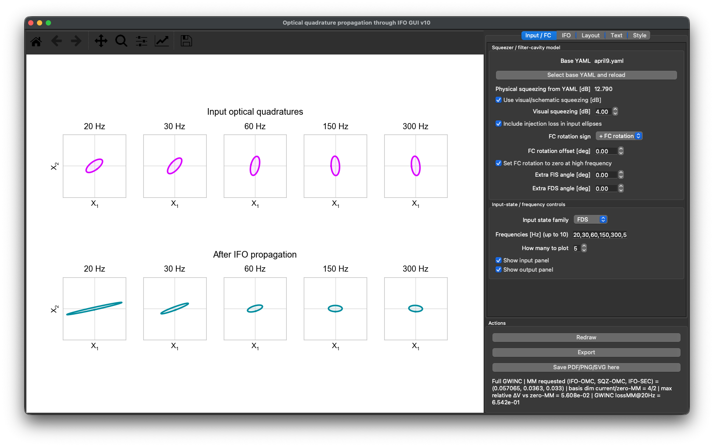

# Optical quadrature propagation through a GWINC interferometer

Interactive PyQt/Matplotlib GUI for visualizing optical quadrature covariance ellipses before and after propagation through a LIGO-like interferometer model.

The input state can be vacuum, frequency-independent squeezing (FIS), or frequency-dependent squeezing (FDS). The interferometer stage is built with the quantum-noise matrices from the selected GWINC YAML model, including optomechanical response, SEC detuning, internal optical loss, and spatial mode mismatch.

## Interface Preview 



## Features

- Vacuum, FIS, and FDS input states.
- Frequency-dependent input ellipse rotation from the filter-cavity model in the YAML.
- Full GWINC interferometer propagation or an ideal zero-loss/tuned reference model.
- GUI overrides for arm power, arm length, SEC detuning, and mode matching.
- IFO–OMC, SQZ–OMC, and IFO–SEC mismatch amplitude and phase controls.
- Shared input-axis and output-axis limits.
- Configurable labels, fonts, legends, colors, and panel layout.
- Export of the **exact currently visible figure panel**. Export does not recompute or reflow the figure.
- Numerical mode-mismatch diagnostic against an otherwise identical zero-mismatch GWINC model.

# How the ellipses are computed

> GitHub rendering note: display equations below use fenced `math` blocks rather than multiline `$$` delimiters. This prevents ordinary Markdown parsing (especially Setext-heading parsing of standalone `=` lines) from corrupting equations before GitHub renders the LaTeX.

## 1. Covariance convention

Each ellipse represents a real, symmetrized two-quadrature covariance matrix

```math
V =
\begin{pmatrix}
\langle X_1^2\rangle & \tfrac12\langle X_1X_2+X_2X_1\rangle\\
\tfrac12\langle X_1X_2+X_2X_1\rangle & \langle X_2^2\rangle
\end{pmatrix}.
```
The normalization used by the GUI is

```math
V_{\rm vac}=I,
```
so an unsqueezed vacuum state is a unit circle.

If

```math
V = Q\,\mathrm{diag}(\lambda_1,\lambda_2)\,Q^T,
```
the plotted contour is

```math
\mathbf{x}(t)
=
Q
\begin{pmatrix}
\sqrt{\lambda_1} & 0\\
0 & \sqrt{\lambda_2}
\end{pmatrix}
\begin{pmatrix}
\cos t\\
\sin t
\end{pmatrix},
\qquad 0\le t<2\pi.
```
Thus the ellipse axes are the covariance eigenvectors and the semiaxis lengths are the square roots of the covariance eigenvalues. Equivalently, the plotted curve satisfies

```math
\mathbf{x}^T V^{-1}\mathbf{x}=1.
```
## 2. Squeezed input state

For a squeezing level of $s_{\rm dB}$, the code uses the vacuum-normalized principal variances

```math
v_- = 10^{-s_{\rm dB}/10},
\qquad
v_+ = 10^{+s_{\rm dB}/10}.
```
For squeeze angle $\alpha$, define

```math
R(\alpha)=
\begin{pmatrix}
\cos\alpha & -\sin\alpha\\
\sin\alpha & \cos\alpha
\end{pmatrix}.
```
The ideal squeezed-state covariance is

```math
V_{\rm sqz}
=
R(\alpha)
\begin{pmatrix}
v_- & 0\\
0 & v_+
\end{pmatrix}
R^T(\alpha).
```
If injection efficiency is $\eta$, the injected state is mixed with vacuum as

```math
V_{\rm in}
=
\eta V_{\rm sqz}+(1-\eta)I.
```
In the GUI, $\eta=1-L_{\rm inj}$ when injection loss is enabled.

For FIS,

```math
\alpha(f)=\alpha_0+\Delta\alpha_{\rm FIS},
```
so the input ellipse is frequency independent.

## 3. Frequency-dependent squeezing and filter-cavity rotation

For FDS, the input angle is

```math
\alpha(f)
=
\alpha_0+\theta_{\rm FC}(f)+\Delta\alpha_{\rm FDS}.
```
The input filter-cavity rotation is calculated directly from the complex cavity reflectivity. With input-coupler power transmission $T_i$, end transmission $T_e$, round-trip loss $L_{\rm rt}$, and cavity length $L$, the amplitude reflectivities used by the code are

```math
r_1=\sqrt{1-T_i},
\qquad
r_2=\sqrt{(1-T_e)(1-L_{\rm rt})}.
```
For frequency offset $\nu$,

```math
\phi(\nu)=2\pi\nu\frac{2L}{c},
\qquad
z=e^{i\phi},
```
and

```math
r_{\rm cav}(\nu)
=
\frac{r_1-r_2z}{1-r_1r_2z}.
```
Using the upper and lower audio sidebands around the filter-cavity detuning $f_{\rm det}$, the code evaluates

```math
r_+(f)=r_{\rm cav}(f_{\rm det}+f),
\qquad
r_-(f)=r_{\rm cav}(f_{\rm det}-f),
```
and uses the two-photon quadrature rotation

```math
\theta_{\rm FC}(f)
=
\frac12\left[\arg r_+(f)+\arg r_-(f)\right].
```
The phases are unwrapped numerically. The GUI can optionally subtract the high-frequency value, reverse the sign, or add a constant rotation offset.

The filter-cavity expression above is used to construct the **input covariance ellipse**. The subsequent interferometer propagation is handled by GWINC.

## 4. GWINC interferometer propagation

At each plotted audio frequency, the selected YAML is loaded through the GWINC quantum budget. The GUI can then override selected interferometer parameters before the optical matrices are built.

GWINC supplies an optical transfer matrix

```math
H(f)
```
from the antisymmetric-port input field to the output, together with transfer matrices

```math
T_j(f)
```
for vacuum fields entering through internal loss ports.

The interferometer matrix contains the optomechanical response, including radiation-pressure coupling through the test-mass susceptibility. In the full model it also contains SEC detuning, arm/SRC losses, Gouy phases, and the requested spatial mode mismatch.

When mode mismatch is active, GWINC promotes the optical basis from the two fundamental quadratures to a larger basis containing the fundamental mode and higher-order spatial modes.

The GUI embeds the input two-quadrature covariance into this full basis as

```math
V_{\rm full,in}
=
\begin{pmatrix}
V_{\rm in} & 0\\
0 & I_{\rm HOM}
\end{pmatrix}.
```
The higher-order-mode inputs are therefore taken to be vacuum.

The propagated covariance before readout projection is

```math
S_{\rm out}(f)
=
H(f)V_{\rm full,in}(f)H^\dagger(f)
+
\sum_j T_j(f)T_j^\dagger(f).
```
The second term explicitly adds the vacuum fluctuations entering through the GWINC loss ports.

## 5. Fundamental-mode readout projection

A crucial detail is that, once mode mismatch is enabled, the detected fundamental mode is **not** obtained by simply taking the first two rows/columns of the full GWINC covariance.

The GUI instead uses the same local-oscillator vectors generated by GWINC's active optical matrix library. Two orthogonal readout vectors are constructed,

```math
P=
\begin{pmatrix}
p_{X_1}\\
p_{X_2}
\end{pmatrix},
```
with

```math
p_{X_1}=\mathrm{adjoint}[\mathrm{LO}(0)],
\qquad
p_{X_2}=\mathrm{adjoint}[\mathrm{LO}(\pi/2)].
```
The measured two-quadrature covariance is then

```math
V_{\rm out}
=
\operatorname{Re}\left\{
\frac12\left[
P S_{\rm out} P^\dagger
+
\left(P S_{\rm out}P^\dagger\right)^\dagger
\right]
\right\}.
```
This $2\times2$ matrix is what is converted to the output ellipse using the eigenvalue construction in Sec. 1.

This projection is important for mode mismatch: spatial mismatch can move squeezed noise into higher-order modes and mix vacuum back into the detected fundamental mode even when the full optical transformation is lossless.

## 6. Mode-matching controls

The GUI exposes three mismatch paths:

- IFO–OMC
- SQZ–OMC
- IFO–SEC / SEC–ARM

Each has a mismatch amplitude and a phase. In the compatible GWINC model these values are passed to the same fields used by the quantum-noise calculation, and GWINC constructs the corresponding spatial-mode rotation matrices internally.

The GUI deliberately does **not** reproduce GWINC's mode-mismatch matrices by hand.

For diagnostics, the full-GWINC calculation can also be compared numerically with an otherwise identical model in which all three mismatch amplitudes are set to zero. The displayed relative covariance change is based on the Frobenius norm,

```math
\frac{\|V_{\rm out}-V_{\rm out}^{(0\,\mathrm{MM})}\|_F}
{\|V_{\rm out}^{(0\,\mathrm{MM})}\|_F}.
```
## 7. Ideal versus full IFO modes

**Full GWINC IFO** uses the selected YAML plus the GUI overrides and includes the full modeled interferometer propagation described above.

**Zero-loss tuned IFO (ideal)** keeps the same basic arm/SRM optical parameters and arm power but explicitly forces interferometer losses, SEC detuning, and all three mode mismatches to zero. It is intended as a reference propagation model rather than a reconstruction of the full detector.

## 8. Export behavior

The export command captures the already-rendered GUI canvas. It does not rerun GWINC, change the figure dimensions, or apply a tight bounding-box re-layout.

For raster formats such as PNG, the exported file is the current panel rendering. For PDF/SVG, that rendered panel is embedded so that the appearance remains identical to what is visible in the GUI.

This means PDF/SVG exact-view exports prioritize visual identity over editable vector artists.

## Notes on interpretation

The ellipses are covariance visualizations, not optical beam profiles. Their orientation and eccentricity show the quadrature covariance of the optical state at the chosen frequency in the vacuum-normalized convention used above.

The input panel represents the state immediately before the interferometer stage used by this GUI. The output panel represents the GWINC-propagated state after projection back onto the detected fundamental spatial mode.


## Repository contents

```text
.
├── README.md
├── ifo_optical_quadratures.py
├── requirements.txt
├── ui.png
└── .gitignore
```

Detector YAML files are intentionally kept one directory upstream and are not part of this repository.

## Requirements

The GUI uses:

- Python 3.10+
- NumPy
- Matplotlib
- PyYAML
- PyQt5
- Pillow
- GWINC

The script uses internal functions from `gwinc.noise.quantum`, including `shotrad_debug`, `MatsHelper`, `apply_interferometer`, the active optical matrix library, and its LO vectors. Because these APIs can change between GWINC versions, use a GWINC checkout compatible with the YAML/model that you use for the quantum-noise calculation.

Install the ordinary Python dependencies with

```bash
pip install -r requirements.txt
```

and run the GUI from the environment in which your compatible GWINC installation is available.

## Running

You can provide a YAML from the command line:

```bash
python ifo_optical_quadratures.py --yaml ../your_model.yaml
```

or simply run

```bash
python ifo_optical_quadratures.py
```

and select the YAML from the file picker.

The base YAML can also be changed while the GUI is open.


A typical directory layout is:

```text
parent-directory/
├── april9.yaml
├── another_detector_model.yaml
└── output-qstate-ellipse-visualizer/
    ├── README.md
    ├── ifo_optical_quadratures.py
    ├── requirements.txt
    ├── ui.png
    └── .gitignore
```

For that layout, launch with for example:

```bash
python ifo_optical_quadratures.py --yaml ../april9.yaml
```

The YAML file picker can also select a model from any location. Keeping detector-specific YAML files upstream simply keeps them outside this public repository.

### Parameter conventions

- `Optics.SRM.Tunephase` / SEC detuning is interpreted in **radians**.
- `Squeezer.SQZAngle` is read from the YAML in radians and converted internally for the GUI angle controls.
- Filter-cavity detuning is in Hz.
- Mode-matching phases are in radians.
- The plotted covariance is vacuum normalized, so unsqueezed vacuum is the unit circle.

---

