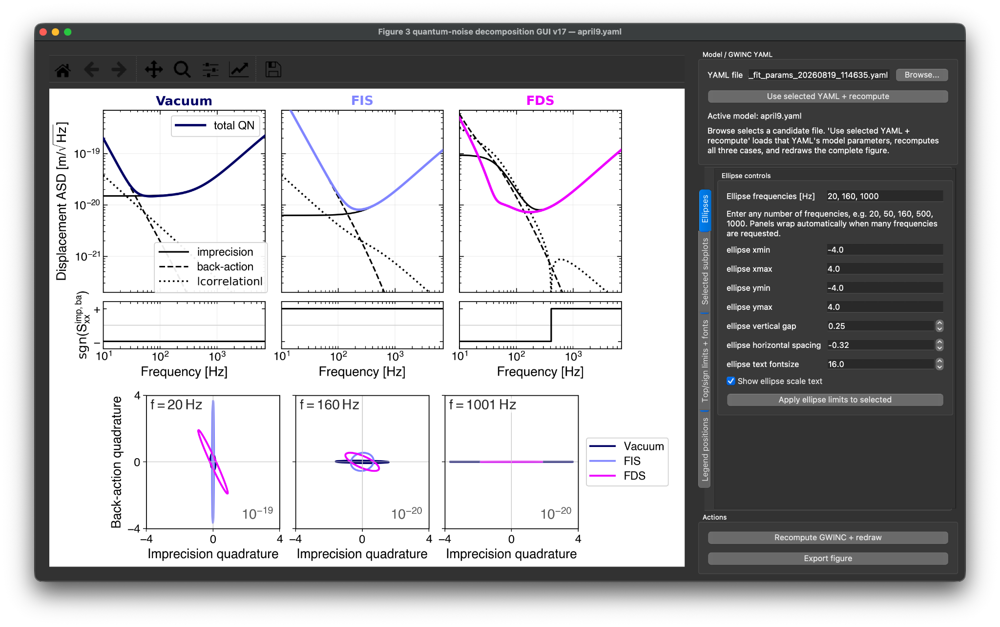

# Quantum-noise decomposer

Interactive PyQt/Matplotlib GUI for decomposing a GWINC quantum-noise model into imprecision, back-action, and correlation terms and visualizing the corresponding two-quadrature covariance ellipses.

The tool compares three configurations:

- **Vacuum** — no injected squeezing,
- **FIS** — frequency-independent squeezing,
- **FDS** — frequency-dependent squeezing.

A detector model is loaded from a GWINC YAML file. The GUI evaluates the quantum-noise spectrum at three arm powers, performs the decomposition frequency by frequency, and displays both the spectral components and covariance ellipses at user-selected frequencies.

## Interface preview



## What the figure shows

The top row shows, for Vacuum, FIS, and FDS:

- total quantum-noise amplitude spectral density,
- imprecision contribution,
- back-action contribution,
- magnitude of the correlation contribution.

The narrow middle row shows the **sign of the correlation term**.

The lower panels show covariance ellipses in an imprecision/back-action quadrature plane at any user-selected set of frequencies. The number of ellipse panels is not fixed; frequencies can be entered as a comma-, semicolon-, or whitespace-separated list.

## Quantum-noise decomposition

### 1. Power-scaling model

At each frequency, the quantum-noise power spectral density is modeled as

```math
S_{\rm QN}(P)
=
\frac{A}{P}
+
BP
+
C.
```

Here \(P\) is the arm power.

The three terms are interpreted as:

```math
\frac{A}{P}
\quad\text{: imprecision-like contribution},
```

```math
BP
\quad\text{: back-action-like contribution},
```

```math
C
\quad\text{: power-independent correlation contribution}.
```

The GUI evaluates the GWINC quantum-noise PSD at three powers,

```math
P_1 = 0.5P_0,
\qquad
P_2 = P_0,
\qquad
P_3 = 2P_0,
```

where \(P_0\) is the reference arm power.

At each frequency, \(A\), \(B\), and \(C\) are obtained by solving the linear system

```math
\begin{pmatrix}
1/P_1 & P_1 & 1\\
1/P_2 & P_2 & 1\\
1/P_3 & P_3 & 1
\end{pmatrix}
\begin{pmatrix}
A\\
B\\
C
\end{pmatrix}
=
\begin{pmatrix}
S_{\rm QN}(P_1)\\
S_{\rm QN}(P_2)\\
S_{\rm QN}(P_3)
\end{pmatrix}.
```

The plotted decomposition is then evaluated at the reference power \(P_0\):

```math
S_{\rm imp}
=
\frac{A}{P_0},
```

```math
S_{\rm ba}
=
BP_0,
```

```math
S_{\rm xcorr}
=
C.
```

The total quantum-noise PSD shown by the GUI is the GWINC result evaluated directly at \(P_0\).

### 2. ASD representation

The upper panels are plotted as amplitude spectral densities.

For the positive contributions,

```math
{\rm ASD}_{\rm QN}
=
\sqrt{S_{\rm QN}},
```

```math
{\rm ASD}_{\rm imp}
=
\sqrt{S_{\rm imp}},
```

```math
{\rm ASD}_{\rm ba}
=
\sqrt{S_{\rm ba}}.
```

The correlation term can be positive or negative, so its magnitude is plotted as

```math
{\rm ASD}_{\rm xcorr}
=
\sqrt{|S_{\rm xcorr}|}.
```

Its sign is shown separately in the narrow strip beneath the spectra:

```math
\mathrm{sgn}
\left(
S_{\rm xcorr}
\right).
```

This keeps the logarithmic ASD plot well defined while retaining the information about whether the correlation contribution is positive or negative.

## Covariance ellipses

### 3. Two-quadrature covariance matrix

At a selected frequency, the decomposition is mapped onto a real symmetric covariance-like matrix

```math
V
=
\begin{pmatrix}
S_{\rm imp} & S_{\rm xcorr}/2\\
S_{\rm xcorr}/2 & S_{\rm ba}
\end{pmatrix}.
```

The horizontal coordinate is labeled **Imprecision quadrature**, and the vertical coordinate is labeled **Back-action quadrature**.

The factor of \(1/2\) in the off-diagonal element follows the usual convention in which the total variance of the sum of two correlated quantities contains

```math
2V_{12}
=
S_{\rm xcorr}.
```

Thus,

```math
S_{\rm imp}
+
S_{\rm ba}
+
S_{\rm xcorr}
```

is represented by the diagonal terms plus twice the covariance.

### 4. Ellipse construction

The matrix is symmetrized numerically and diagonalized:

```math
V
=
Q
\begin{pmatrix}
\lambda_1 & 0\\
0 & \lambda_2
\end{pmatrix}
Q^T.
```

The plotted contour is

```math
\mathbf{x}(t)
=
Q
\begin{pmatrix}
\sqrt{\lambda_1} & 0\\
0 & \sqrt{\lambda_2}
\end{pmatrix}
\begin{pmatrix}
\cos t\\
\sin t
\end{pmatrix},
\qquad
0\le t<2\pi.
```

The ellipse orientation is therefore set by the covariance eigenvectors, while its semiaxis lengths are set by the square roots of the covariance eigenvalues.

For numerical robustness, any small negative eigenvalues are clipped to zero before taking the square root.

### 5. Per-panel scale factors

The absolute ellipse coordinates can differ by many orders of magnitude across frequency. To keep the panels readable, each ellipse panel is divided by a power-of-ten scale factor,

```math
s = 10^{\lfloor \log_{10} x_{\max}\rfloor},
```

where \(x_{\max}\) is the largest absolute ellipse coordinate among the displayed Vacuum, FIS, and FDS states in that panel.

The scale shown in the lower-right corner of each ellipse panel indicates this normalization.

## GWINC model handling

The GUI loads the selected YAML through the GWINC `Quantum` budget.

For the three displayed cases:

- **Vacuum:** the squeezer block is removed from the active interferometer structure.
- **FIS:** the squeezer is configured as frequency independent.
- **FDS:** the squeezer is configured as frequency dependent and uses the filter-cavity parameters present in the selected model.

Where available, the script reads or applies model quantities including:

- homodyne/readout quadrature,
- photodetector efficiency,
- arm length,
- arm power,
- SEC detuning,
- injected squeezing level,
- injection loss,
- squeezing phase noise,
- filter-cavity detuning,
- filter-cavity mode mismatch and phase,
- IFO–OMC mismatch and phase,
- SQZ–OMC mismatch and phase.

When a new YAML is selected from the GUI, the tool first evaluates the candidate model. The active model is replaced only after the new calculation succeeds.

## Assumptions and interpretation

This decomposition is a compact diagnostic representation of the modeled quantum noise. Its interpretation relies on several assumptions:

- The quantum-noise PSD is represented over the chosen power range by
  \(A/P + BP + C\).
- The three coefficients are determined from exactly three arm powers:
  \(0.5P_0\), \(P_0\), and \(2P_0\).
- The \(A/P_0\) term is labeled imprecision, \(BP_0\) is labeled back-action, and \(C\) is labeled correlation.
- The correlation term is allowed to be positive or negative.
- The ellipse representation uses only these three decomposed quantities; it is not a reconstruction of the full optical multimode quantum state.
- The decomposition is applied to the GWINC **quantum-noise** model, not to measured detector data.
- Results depend on the selected detector YAML, the installed GWINC version, and the model fields available in that version.
- If the true model contains additional power dependences that are not well represented by \(A/P + BP + C\), the fitted terms should be interpreted as an effective three-term decomposition over the sampled power range.
- Small negative covariance eigenvalues are clipped to zero for plotting rather than treated as physical negative variances.

The tool is therefore intended for model inspection, visualization, and figure generation rather than as a general-purpose estimator of independently measured noise sources.

## Interface controls

### Static model controls

The selected GWINC YAML is always visible at the top of the right-hand panel. A candidate YAML can be browsed and tested before replacing the current model.

### Ellipses

Controls:

- arbitrary ellipse-frequency list,
- ellipse x/y limits,
- spacing between the spectral and ellipse regions,
- horizontal spacing between ellipse panels,
- ellipse annotation font size,
- display of per-panel scale factors.

### Selected subplots

Top spectra, sign strips, and individual ellipse panels can be selected independently before applying limits or font changes.

The ellipse-selection list updates automatically when the requested frequencies change.

### Top/sign limits + fonts

Controls the x/y limits of selected spectral/sign panels and the title, axis, and legend font sizes.

### Legend positions

The total-QN legend, decomposition-component legend, and ellipse-case legend are independent.

Each legend can either remain attached to its original axes or be moved freely in normalized figure coordinates.

### Persistent actions

**Recompute GWINC + redraw** and **Export figure** remain visible at the bottom of the right-hand panel regardless of which control layer is active.

## Requirements

- Python 3.10+
- NumPy
- Matplotlib
- PyQt5
- GWINC

Install the ordinary Python dependencies with

```bash
pip install -r requirements.txt
```

GWINC must be installed separately in the same Python environment. Because the script accesses the GWINC detector structure and `Quantum` budget directly, use a GWINC checkout compatible with the YAML model being loaded.

## Running

Provide a detector YAML explicitly:

```bash
python qnoise_decomposer.py --yaml ../april9.yaml
```

Multiple initial ellipse frequencies can also be supplied:

```bash
python qnoise_decomposer.py \
    --yaml ../april9.yaml \
    --ellipse-freqs 20 50 160 500 1000
```

If `--yaml` is omitted, the script attempts to find a YAML in the current working directory.

Detector-specific YAML files are intentionally not included in this repository and can be kept one directory upstream or elsewhere on the local system.

## Export

The GUI exports PDF, PNG, or SVG using the Matplotlib canvas renderer directly.

This deliberately bypasses `Figure.savefig()` so the export remains reliable even in long-lived Spyder/Qt sessions where another script may have intercepted or monkey-patched `savefig`.

## Repository contents

```text
.
├── README.md
├── qnoise_decomposer.py
├── requirements.txt
├── ui.png
└── .gitignore
```

## Manuscript context

This tool was developed while preparing **_Quantum Noise Engineering in Advanced LIGO_**, a review article in preparation for *Contemporary Physics*.

It is intended as a companion visualization and figure-building tool for the discussion of quantum measurement imprecision, radiation-pressure back-action, and quantum-noise correlations in that manuscript.
