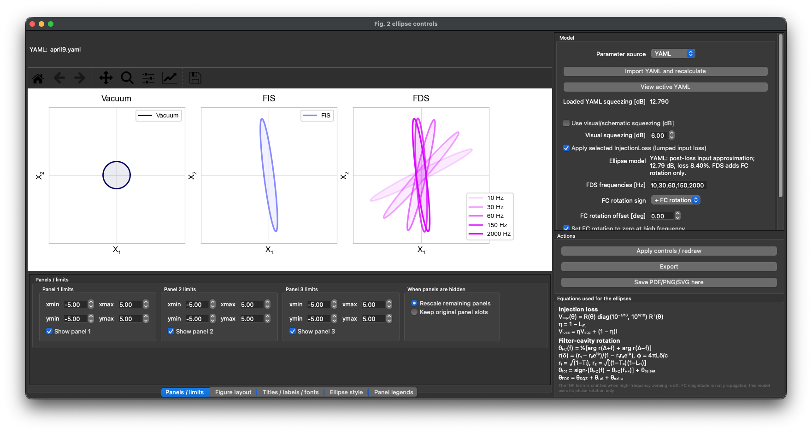

# Squeezing Ellipse Visualizer

An interactive PyQt5 tool for exploring input quantum state quadrature
representations for vacuum,
frequency-independent squeezing (FIS), and frequency-dependent squeezing
(FDS). It is designed as a companion visualization for an introduction to
quantum noise and squeezed-light enhancement in LIGO.

The model begins with an initial squeezing level, applies injection loss as a
lumped loss (Equation 1) across all frequencies, then applies the phase
rotation calculated from the filter-cavity parameters (Equation 2).

**Equation 1 — Lumped injection loss**

$$
\begin{aligned}
\mathbf{V}_{\mathrm{sqz}}(\theta)
&= \mathbf{R}(\theta)
   \begin{bmatrix}
   10^{-s/10} & 0 \\
   0 & 10^{s/10}
   \end{bmatrix}
   \mathbf{R}^{\mathsf{T}}(\theta), \\
\eta &= 1-L_{\mathrm{inj}}, \\
\mathbf{V}_{\mathrm{loss}}
&= \eta\,\mathbf{V}_{\mathrm{sqz}}+(1-\eta)\mathbf{I}.
\end{aligned}
\tag{1}
$$

Here, $s$ is the initial squeezing level in dB, $L_{\mathrm{inj}}$ is the
fractional injection power loss, and vacuum noise is normalized to
$\mathbf{I}$.

**Equation 2 — Filter-cavity phase rotation**

$$
\begin{aligned}
\theta_{\mathrm{FC}}(f)
&= \frac{1}{2}\left[
   \arg r(\Delta+f)+\arg r(\Delta-f)
   \right], \\
r(\delta)
&= \frac{r_1-r_2 e^{i\phi(\delta)}}
        {1-r_1r_2 e^{i\phi(\delta)}}, \\
\phi(\delta) &= \frac{4\pi L\delta}{c}, \\
r_1 &= \sqrt{1-T_i}, \\
r_2 &= \sqrt{(1-T_e)(1-L_{\mathrm{rt}})}, \\
\theta_{\mathrm{rot}}(f)
&= s_{\mathrm{FC}}\left[
   \theta_{\mathrm{FC}}(f)-\theta_{\mathrm{FC}}(f_{\mathrm{HF}})
   \right]+\theta_{\mathrm{offset}}, \\
\theta_{\mathrm{FDS}}(f)
&= \theta_{\mathrm{SQZ}}+\theta_{\mathrm{rot}}(f)
   +\theta_{\mathrm{extra}}.
\end{aligned}
\tag{2}
$$

The $\theta_{\mathrm{FC}}(f_{\mathrm{HF}})$ term is omitted when
high-frequency zeroing is disabled. The factor $s_{\mathrm{FC}}$ is the
user-selected rotation sign.

## Interface preview



*The visualizer showing the vacuum, FIS, and frequency-dependent FDS states,
with model controls and the equations used to construct the ellipses.*

## What the tool does

- Displays vacuum, FIS, and FDS ellipses in separate configurable panels.
- Calculates the frequency-dependent rotation produced by a detuned filter
  cavity.
- Applies a selectable lumped injection loss to the squeezing covariance.
- Accepts model parameters from YAML or through full manual controls.
- Exports the displayed figure as PDF, PNG, or SVG.
- Exposes figure layout, labels, styles, limits, and legends through the GUI.

For FDS, the filter-cavity phase rotation is added to the squeezing angle. The
tool uses the phase of the cavity reflection coefficient; it does **not**
propagate the reflected magnitude or the corresponding vacuum coupling from
filter-cavity loss. It also does not model the interferometer, output mode
cleaner, readout loss, phase noise, or mode mismatch. It is therefore a state
visualizer rather than a replacement for a full quantum-noise model.

## Installation

Python 3.10 or newer is recommended.

```bash
cd squeezing-ellipse-visualizer
python3 -m venv .venv
source .venv/bin/activate
python -m pip install --upgrade pip
python -m pip install -r requirements.txt
```

On Windows, activate the environment with `.venv\Scripts\activate`.

## Running the GUI

No YAML file is required. The tool opens with built-in illustrative values in
**Full manual** mode:

```bash
python squeezing_ellipse_visualizer.py
```

To load a compatible YAML file at startup:

```bash
python squeezing_ellipse_visualizer.py --yaml path/to/model.yaml
```

You can also import a YAML file from inside the GUI. After a successful import,
the parameter source can be switched between **YAML** and **Full manual**.

## YAML fields used

```yaml
Squeezer:
  AmplitudedB: 6.0       # squeezing in dB
  InjectionLoss: 0.05   # fractional power loss
  SQZAngle: 0.0          # radians
  FilterCavity:
    L: 300.0             # metres
    Ti: 0.0008
    Te: 0.000001
    Lrt: 0.0001
    fdetune: -25.0       # Hz
```

## Outputs

Use **Export** to select a destination and format. The convenience button
**Save PDF/PNG/SVG here** writes all three formats plus a settings summary to
the directory from which the program was launched.

## Citation and license

If you use this tool in published work, please cite the accompanying paper and
the repository release. Repository-wide citation metadata can be provided in a
root-level `CITATION.cff`.

This tool is distributed under the license specified at the repository root.
